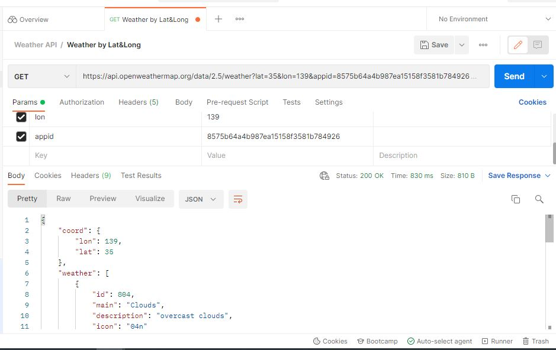
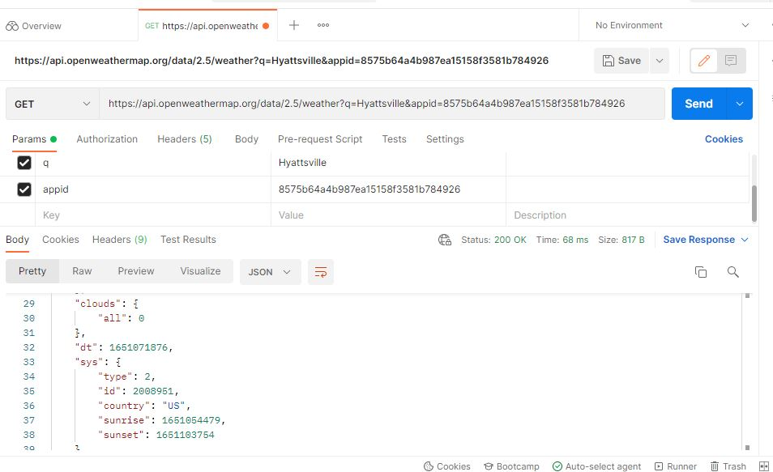
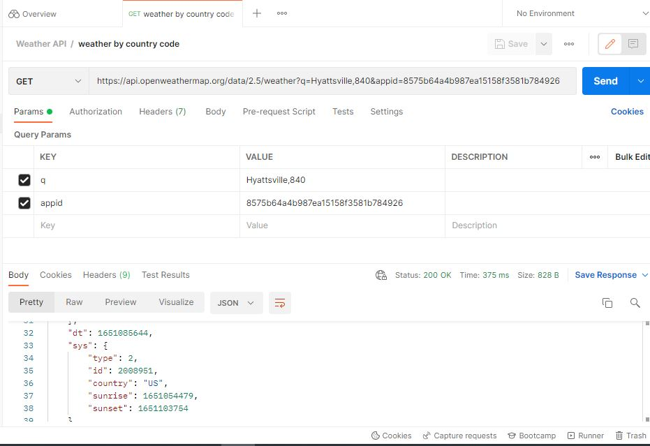
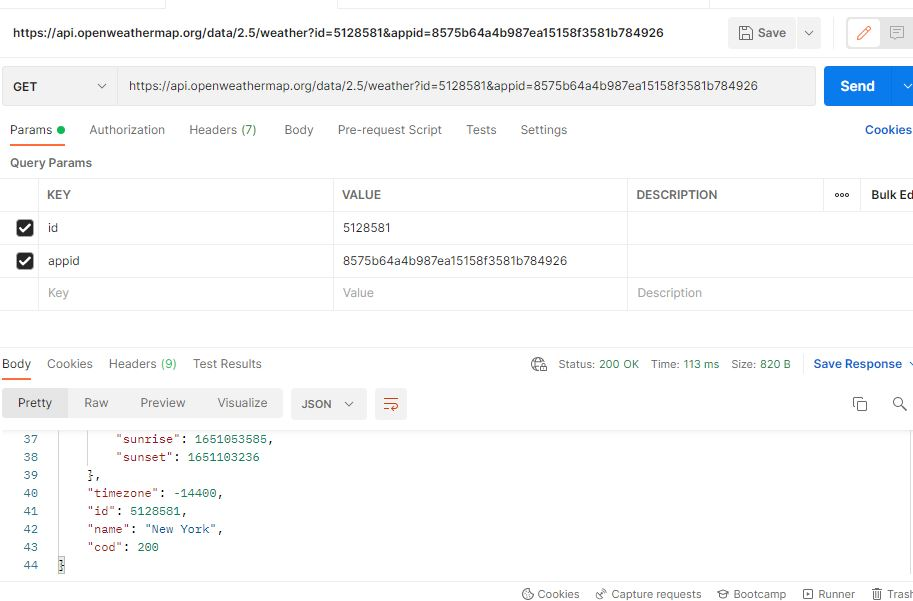
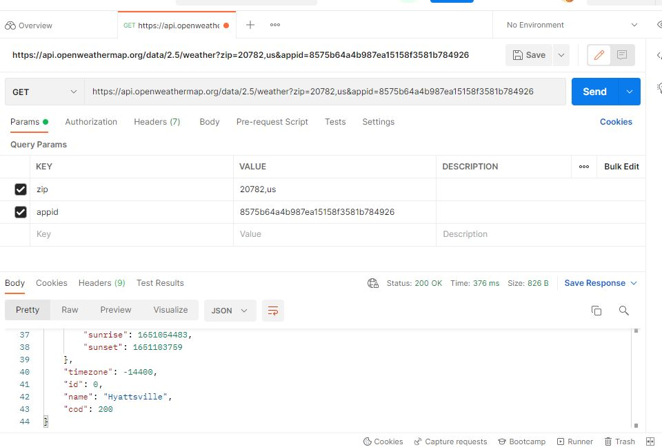
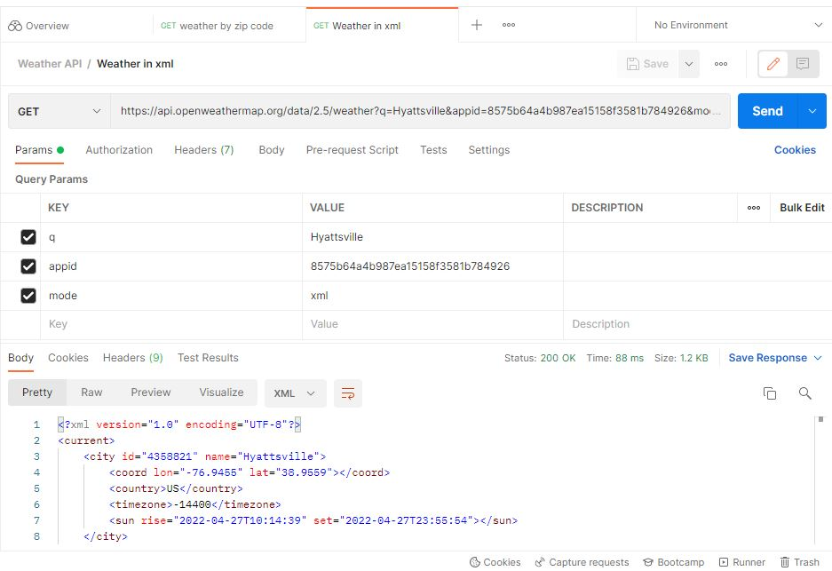
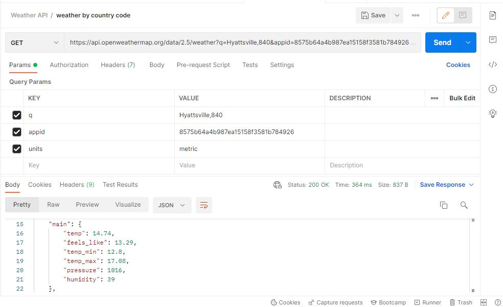
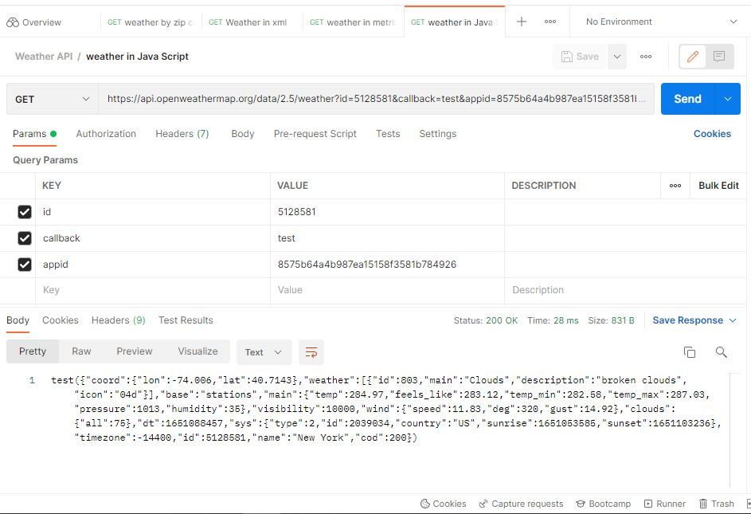

# Current weather data

## How to make an API call

### API call by latitude and longitude

https://api.openweathermap.org/data/2.5/weather?lat=35&lon=139&appid=8575b64a4b987ea15158f3581b784926

### API call by city

https://api.openweathermap.org/data/2.5/weather?q=Hyattsville&appid=8575b64a4b987ea15158f3581b784926

### API call by city and country code

https://api.openweathermap.org/data/2.5/weather?q=Hyattsville,840&appid=8575b64a4b987ea15158f3581b784926

### API call by city id

https://api.openweathermap.org/data/2.5/weather?id=5128581&appid=8575b64a4b987ea15158f3581b784926

### API call by zip code

https://api.openweathermap.org/data/2.5/weather?zip=20782,us&appid=8575b64a4b987ea15158f3581b784926

### API call in XML

https://api.openweathermap.org/data/2.5/weather?q=Hyattsville&appid=8575b64a4b987ea15158f3581b784926&mode=xml

### API call in matric unit

https://api.openweathermap.org/data/2.5/weather?q=Hyattsville,840&appid=8575b64a4b987ea15158f3581b784926&units=metric

### API call  Java Script

https://api.openweathermap.org/data/2.5/weather?id=5128581&callback=test&appid=8575b64a4b987ea15158f3581b784926

