# SQL Assignment 101

1. PostgreSQL version 12.10 is installed in my window machine folLowing the instruction.
 

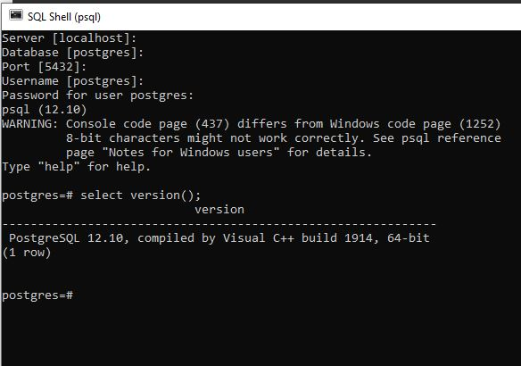
 
2. I have connected my git bash terminal with DB server by adding path "C:\Program Files\PostgrepSQL\14\bin" in the 
environment variable.

- Access the server with a specific user:

psql -U postgres
Password for user postgres:

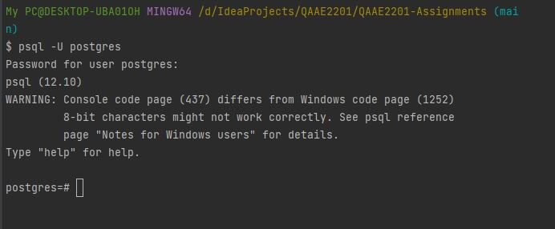

- Executed following command from cheat sheet:

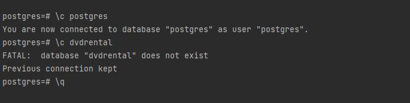

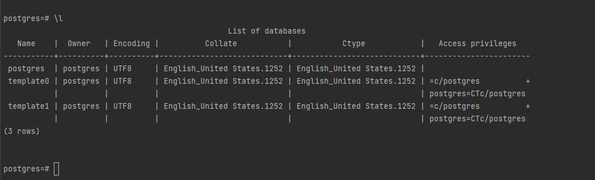

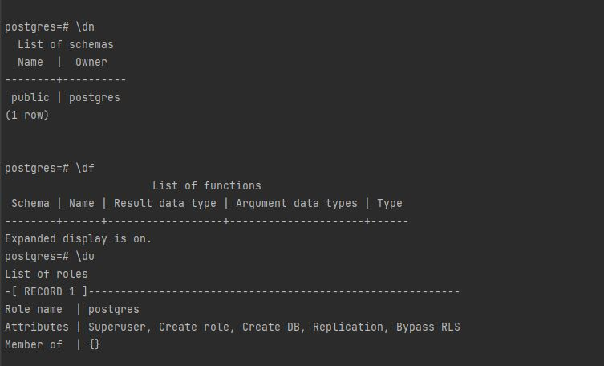

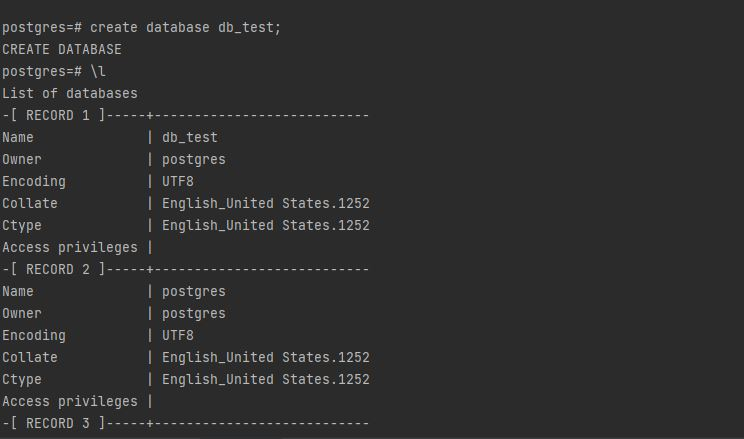

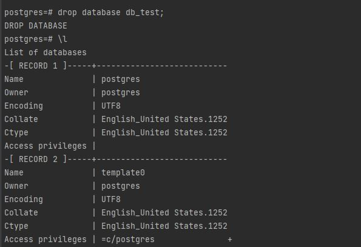

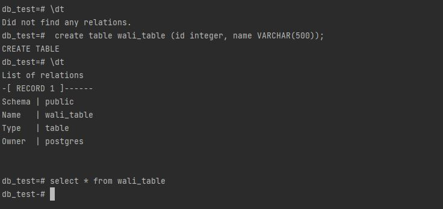

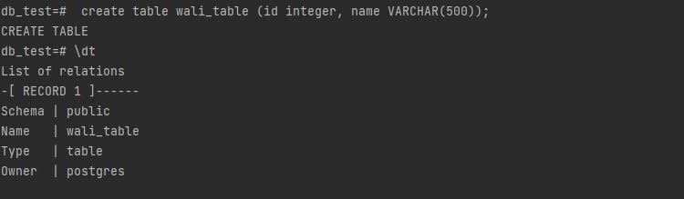

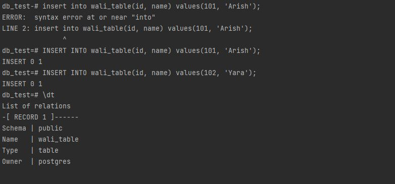

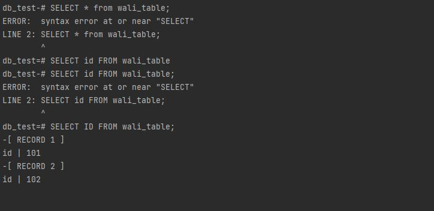

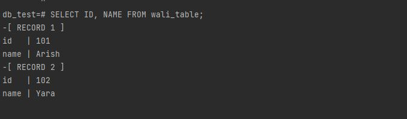

3. PGAdmin already installed with postgreSQL.

4. Then I have practiced some queries in pgadmin 4:

- First I have created a connection in the following ways:
  
I went to Server ---> Register ---> Server

Named as db_test local 
Server group: Servers

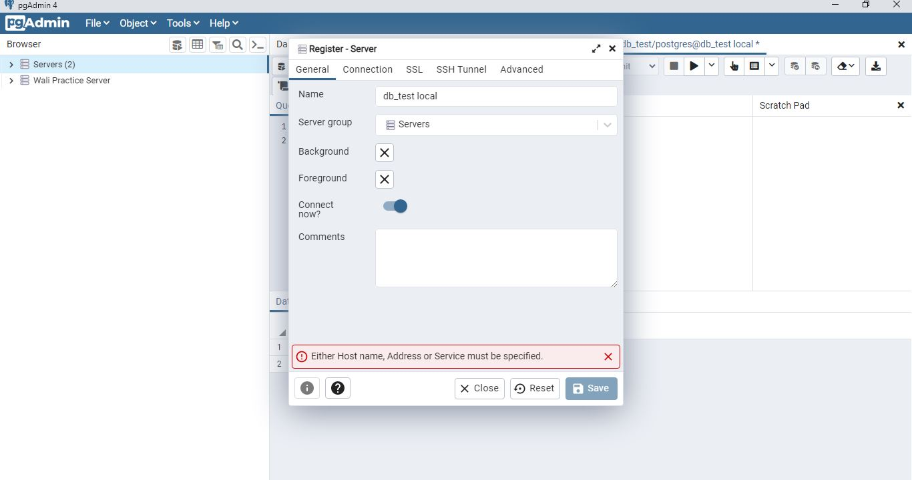

In Connection tab followings were selected:

Hostname: localhost 
Port: 5432
Maintenance database: db_test
Username: postgres
Password: .....

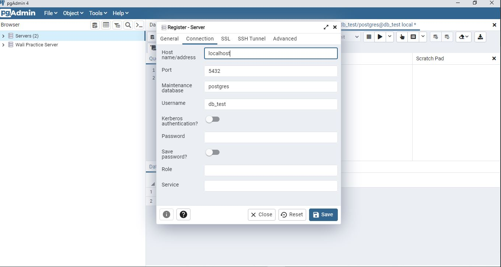

- Then did some queries and got following output:

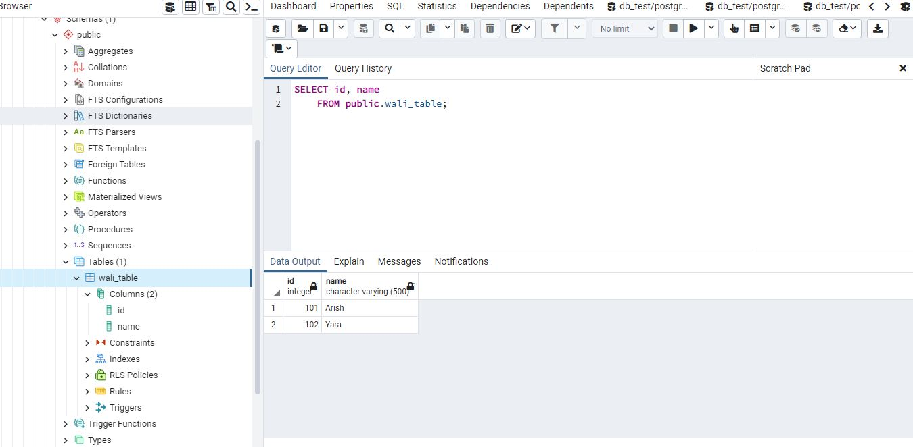

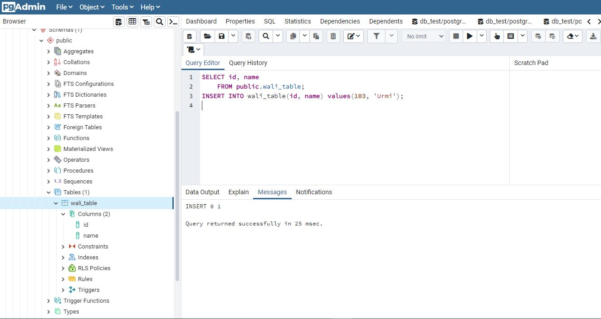

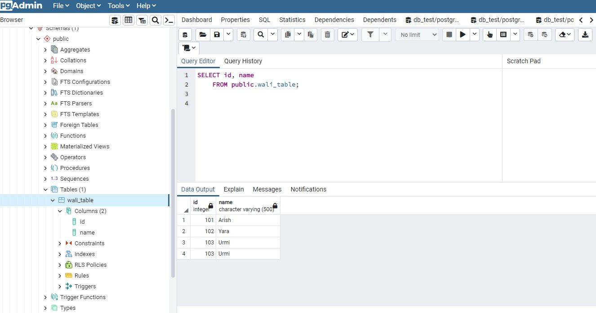

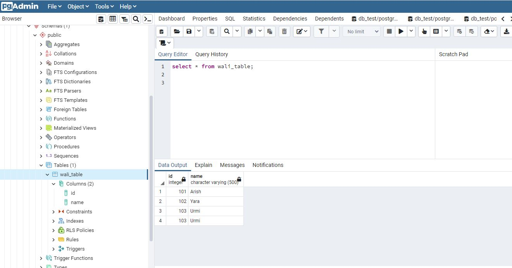

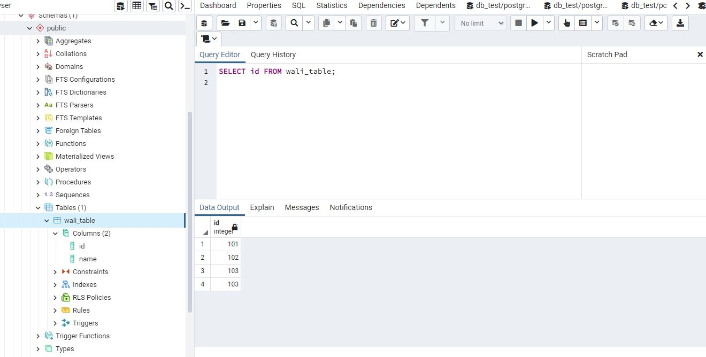

5. I have downloaded DVD rental sample Database form following link:

https://www.postgresqltutorial.com/wp-content/uploads/2019/05/dvdrental.zip

Then I shifted this file to /c/sampledb using git bash

cp /c/Users/My\ Pc/Downloads /c/samplebd [ Before that I created a directory "samplebd" in c drive]

Then I converted .zip file to .tar file using following command

cd /c/sampldb 
unzip dvdrental.zip

Then I created a new database named dvdrental:

psql -U postgres 
postgres=#  create database dvdrental; 
CREATE DATABASE 

postgres=#exit

Then, the sample database "dvdrental" imported by the following commands:

cd /c/Program\ Files/PostgrepSQL/12/bin 
pg_restore -U postgres -d dvdrental /c/sampledb/dvdrental.tar 
password:

Finally it can be varified from  Application -------> PostgreSQL 12 ------> pgAdmin4 ----> Servers ----> PostSQL 12 -----> Database -----> dvdrental

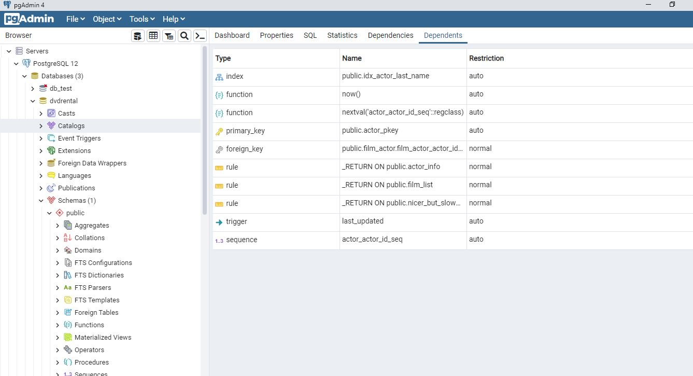

6. Commands practiced from tutorial:

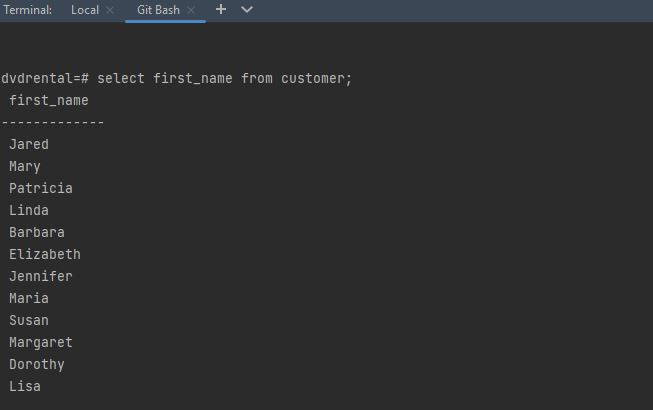

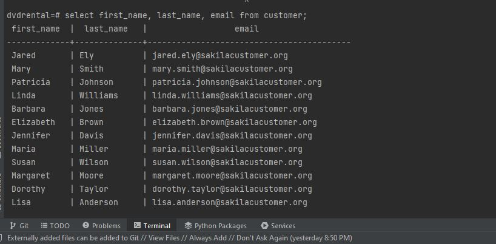

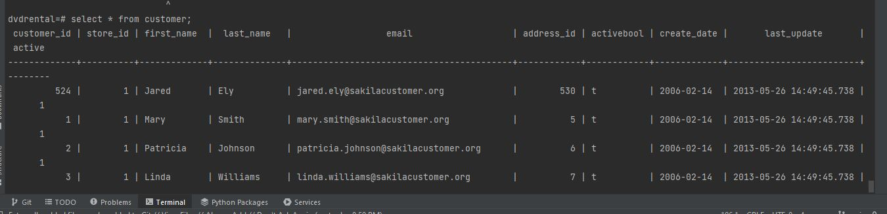

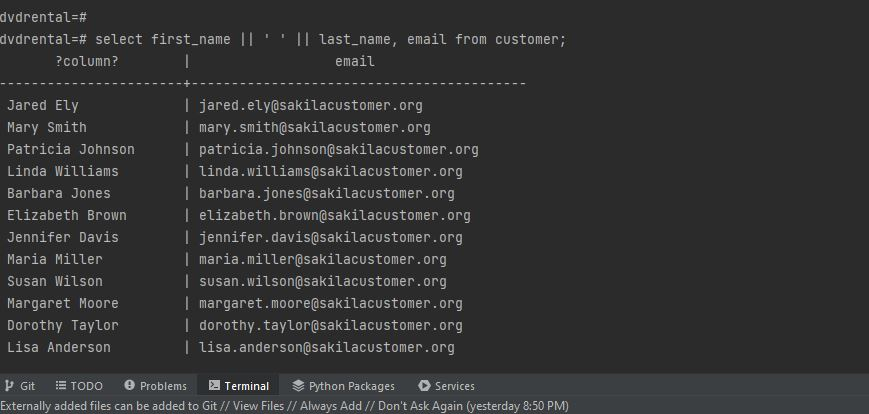

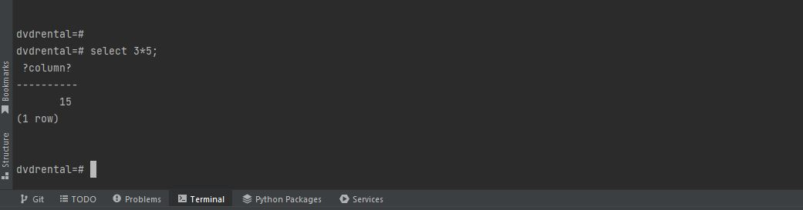