# Lab 5.3: SQL Assignment 03

## Simple Selects

#### 5.3.1: What are all the records in the store table, ordered by the primary key of the table?

Ans: 
```
SELECT *
FROM store
ORDER BY 1;
```
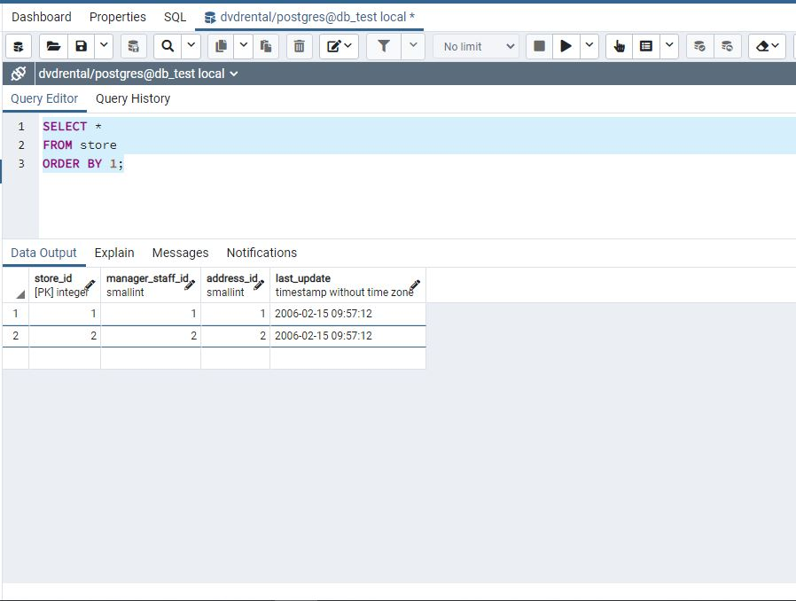

#### 5.3.2: What are the first 10 records in the inventory table in ascending order of update (show just the primary key and the update timestamp)?

Ans:
```
SELECT inventory_id, last_update
FROM inventory
ORDER BY last_update asc
LIMIT 10;
```

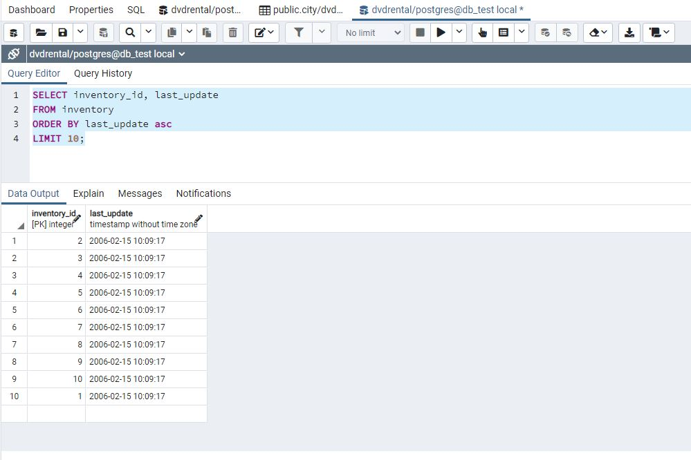

## Selects from more than 1 table

#### 5.3.3: What is the street address, district, city name, and phone number for all addresses in the 18743 postal code?

Ans: 

```
SELECT  a.address as "street address",
        a.district,
        c.city as "city name",
        a.phone as "phone number"
FROM	address AS a
INNER JOIN city AS c ON c.city_id = a.city_id
WHERE   a.postal_code = '18743';
```

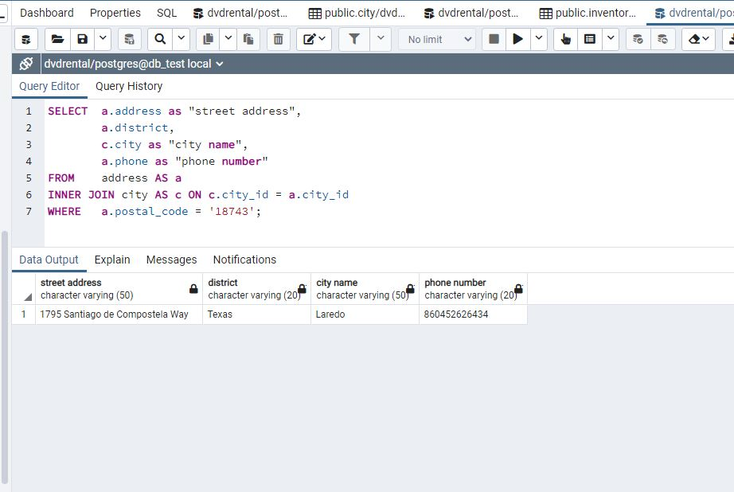

## Aggregate Selects

#### 5.3.4: How many records are in the inventory table?

Ans:
```
SELECT count(*)
FROM inventory;
```

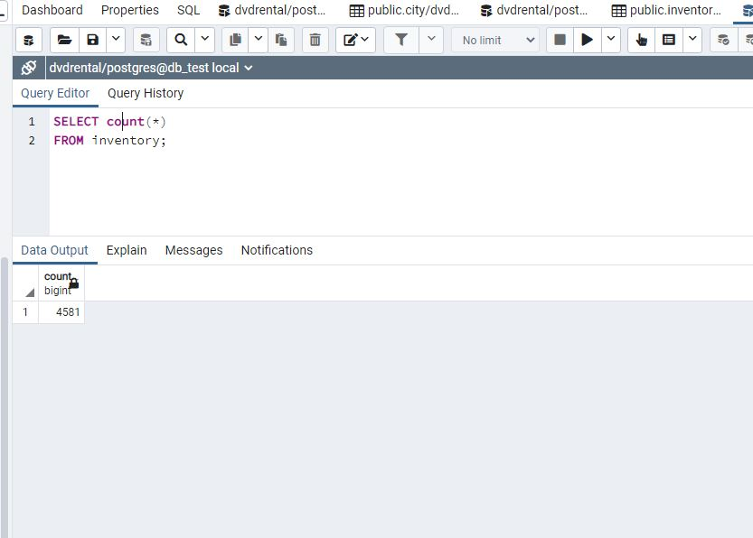

#### 5.3.5: What is the timestamp of the most recent update to the staff table?

Ans:
```
SELECT last_update
FROM staff
ORDER BY last_update desc
LIMIT 1;
```

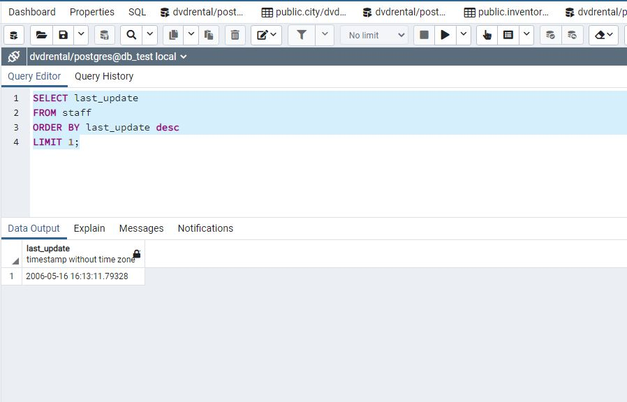

#### 5.3.6: How many distinct values of country_id exist in the city table?

Ans: 
```
SELECT count(country_id)
FROM city
WHERE country_id IS NOT NULL;
```

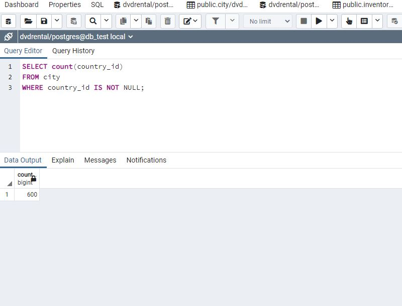

#### 5.3.7: How many actors' last names begin with either a "B" or a "C"?

Ans: 
```
SELECT count(last_name)
FROM actor
WHERE last_name ~ '^[BC]';
```

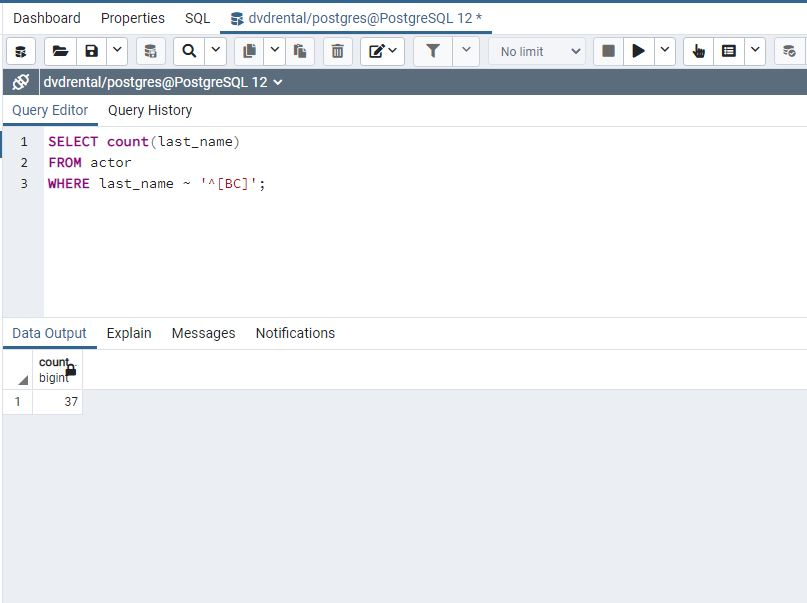

#### 5.3.8: What is the average payment amount (rounded to the nearest cent) and number of payments made in the month of April, 2007, by customers that are currently active, and whose average payment is at least $5.00?

Ans:
```
SELECT 	p.customer_id,
		ROUND(avg(p.amount),2) as "average payment amount",
		count(*) as "number of payments made"
FROM	payment AS p
INNER 	JOIN customer AS c ON c.customer_id=p.customer_id
WHERE 	CAST(p.payment_date AS DATE) between '2007-04-01' and '2007-04-30' and
		c.active=1
GROUP BY p.customer_id
HAVING 	avg(p.amount) >= 5.00;
```

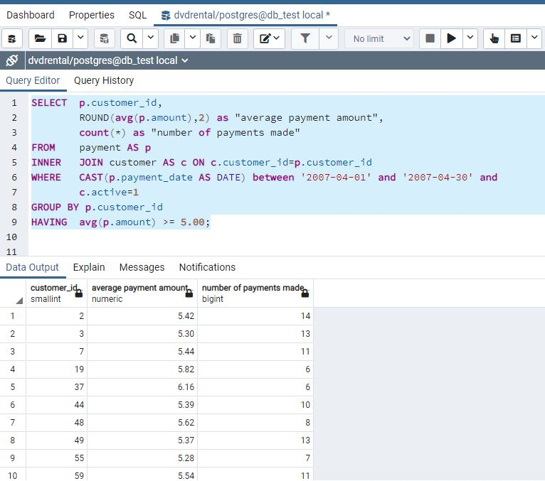

#### 5.3.9: Show customer's first and last name and email, and label the average payment field as "Avg. Payment Amount" and the number of payments field as "Number of Payments".

Ans:

```
SELECT 	p.customer_id,
		c.first_name, 
		c.last_name,
		c.email,
		avg(p.amount) as "Avg. Payment Amount",
		count(*) as "Number of Payments"
FROM 	customer AS c 
INNER JOIN payment AS p ON p.customer_id=c.customer_id
GROUP BY p.customer_id, c.first_name, c.last_name, c.email
```

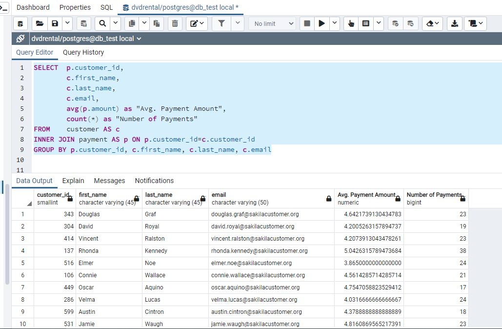

#### 5.3.10: Order the results by highest payment first, and then by last name.

Ans:

```
SELECT 	p.customer_id,
		c.first_name, 
		c.last_name,
		c.email,
		ROUND(avg(p.amount),2) as "Avg. Payment Amount",
		sum(p.amount) as "Total payment amount",
		count(*) as "Number of Payments"
FROM 	customer AS c 
INNER JOIN payment AS p ON p.customer_id=c.customer_id
GROUP BY p.customer_id, c.first_name, c.last_name, c.email
ORDER BY 	"Total payment amount" desc,
			c.last_name
```

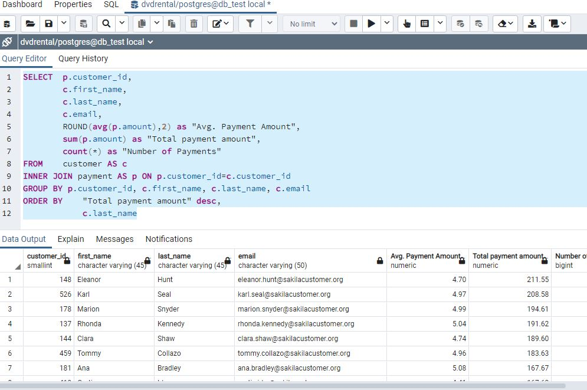

## Set Theory Selects

#### 5.3.11: What are all the first names of both the actors and the staff members that begin with the letter 'S' (in alphabetical order)?

Ans:
```
SELECT 	first_name
FROM actor
WHERE first_name LIKE 'S%'

UNION ALL

SELECT first_name
FROM staff
WHERE first_name LIKE 'S%'

ORDER BY first_name
```

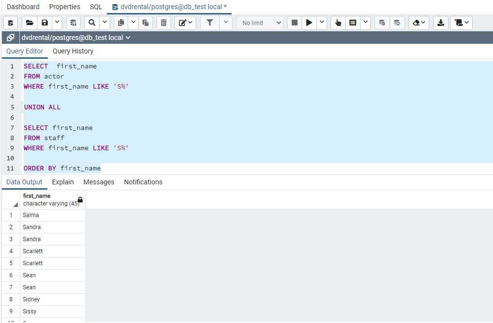

#### 5.3.12: Show the title of the films that Jon rented on May 29, 2005 in common with those that Mike rented on June 20, 2005. Order by film title.

Ans: No Output were found when query searched the value for "Jon rented on May 29, 2005"

```
SELECT 	f.title	
FROM	film as f
INNER JOIN inventory as i ON i.film_id=f.film_id
INNER JOIN rental as r ON r.inventory_id=i.inventory_id
INNER JOIN customer as c ON c.customer_id=r.customer_id
WHERE 	c.first_name='Jon' and
		CAST(r.rental_date AS DATE)='2005-05-29'

INTERSECT

SELECT 	f.title
FROM	film as f
INNER JOIN inventory as i ON i.film_id=f.film_id
INNER JOIN rental as r ON r.inventory_id=i.inventory_id
INNER JOIN customer as c ON c.customer_id=r.customer_id
WHERE 	c.first_name='Mike' and
		CAST(r.rental_date AS DATE)='2005-06-20';
```

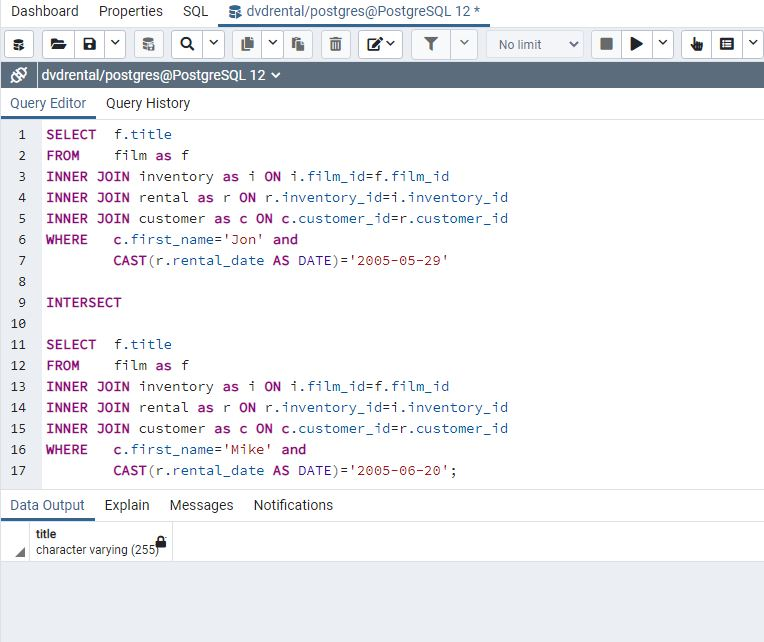

Because, in fact there is no value for Jon on that particular date.

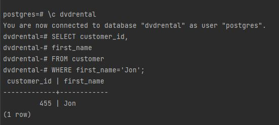

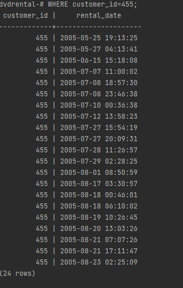

To verify, I used customer 'Norman' whose customer_id is 411 and date July 29, 2005. Found a film title 'Boogie Amelie'

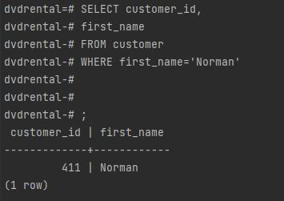

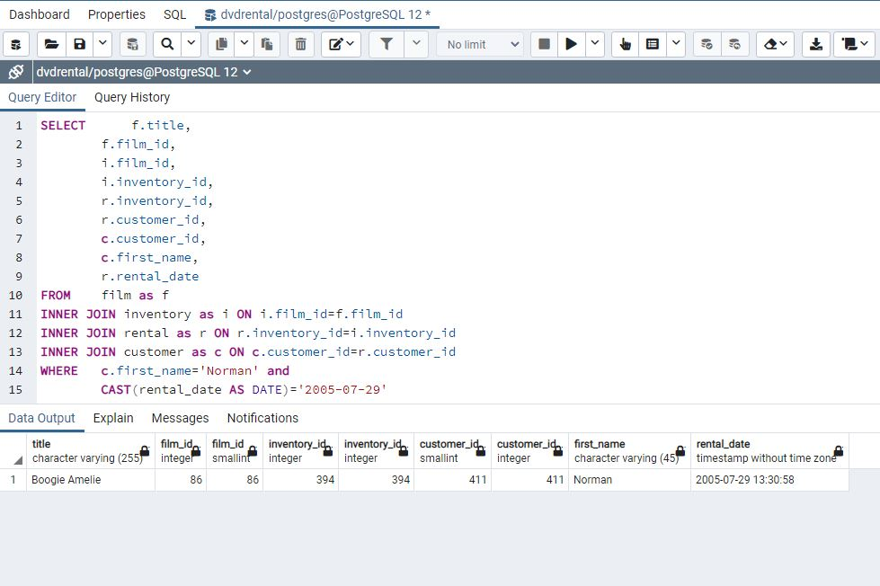

Then I did same procedure for Mike on June 20, 2005 and found two films named Boogie Amelie and Camelot Vacation. Where Boogie Amelie film title is common with customer Norman.

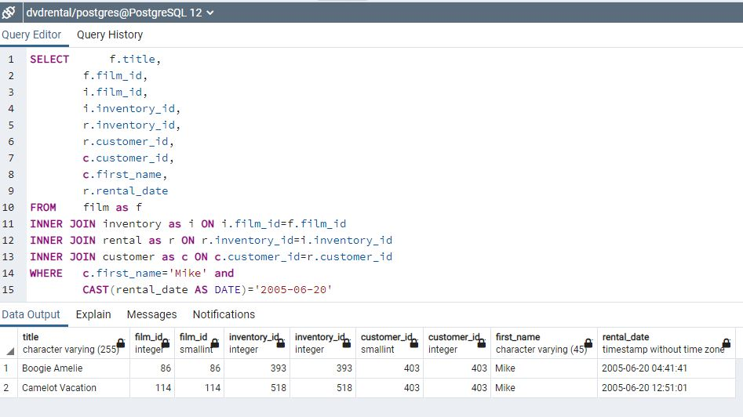

Finally, I tried with customers Norman, Mike and found the following output:

```
SELECT 	f.title	
FROM	film as f
INNER JOIN inventory as i ON i.film_id=f.film_id
INNER JOIN rental as r ON r.inventory_id=i.inventory_id
INNER JOIN customer as c ON c.customer_id=r.customer_id
WHERE 	c.first_name='Norman' and
		CAST(r.rental_date AS DATE)='2005-07-29'

INTERSECT

SELECT 	f.title
FROM	film as f
INNER JOIN inventory as i ON i.film_id=f.film_id
INNER JOIN rental as r ON r.inventory_id=i.inventory_id
INNER JOIN customer as c ON c.customer_id=r.customer_id
WHERE 	c.first_name='Mike' and
		CAST(r.rental_date AS DATE)='2005-06-20';
```

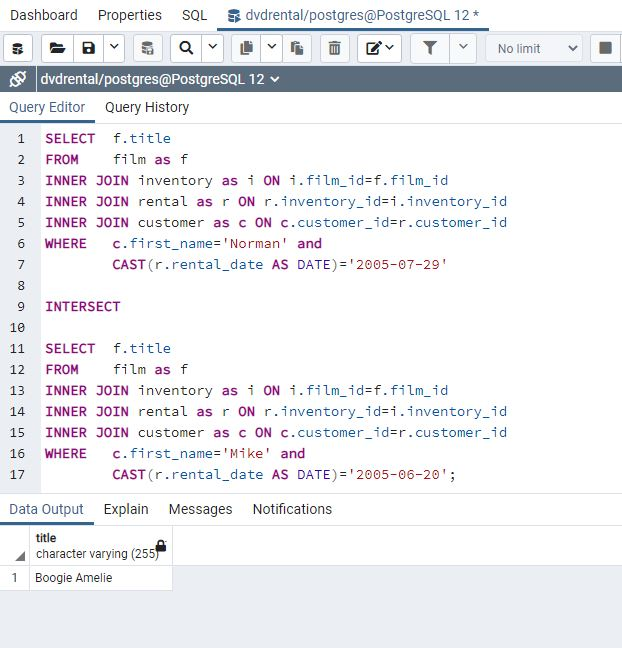